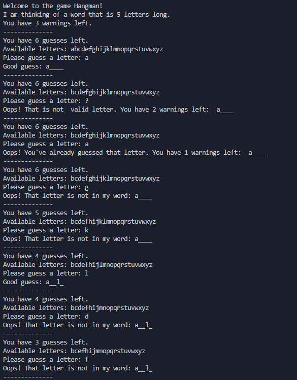

# MIT 6.0001 - Introduction to Computer Science and Programming in Python
While doing MIT 6.0002 (Intro to Data Science), I felt like I was lost and needed to review the basics. Therefore I decided to do the precursor course, 6.0001. 
[Link to 2016 version of the Course](https://ocw.mit.edu/courses/electrical-engineering-and-computer-science/6-0001-introduction-to-computer-science-and-programming-in-python-fall-2016/)

While I did the 2016 version on MIT OCW, there is [a 2020 version on Edx](https://www.edx.org/course/introduction-to-computer-science-and-programming-7)

In the end, I was able to finish the course in **6 days**. However, I already had one year of experience with Python and a good understanding of Computer Science from [Harvard's CS50x course](https://www.edx.org/course/cs50s-introduction-to-computer-science). 

While I did like MIT 6.0001, I felt like I was just manipulating Python's syntax to get the job done, instead of a more analytical approach. However, regarding Python's Syntax, I do believe I learnt a bit throughout the course. 

### Note
As an extra challenge, I decided to write the shortest possible code I can in certain sections, taking full advantage of Python's syntax. If you're writing code with others involved, **always go with the most readable way**, not the shortest.

# Table of Contents
- [Pset 0](#problem-set-0---day-1) - Setup
- [Pset 1](#problem-set-1---day-1) - Binary Search
- [Pset 2](#problem-set-2---day-3) - Hangman
- [Pset 3](#problem-set-3---day-4) - Scrabble
- [Pset 4](#problem-set-4---day-5) - Caesar and Substitution Encryption/Decryption
- [Pset 5](#problem-set-5---day-6) - Google RSS Feed Filter

# What I learnt
## Problem Set 0 - Day 1
- Setting up an Anaconda Environment
- Numpy Basics
- 
[Back to Contents](#table-of-contents)

## Problem Set 1 - Day 1
- Applying Binary Search in a Practical Scenario
- Playing with [Lambda Functions](https://en.wikipedia.org/wiki/Anonymous_function) and [Currying](https://en.wikipedia.org/wiki/Currying)

[Back to Contents](#table-of-contents)

## Day 2
- [Skipped Day 2 to solve CPCS204 Assignment #1](https://twitter.com/Ryan_Samman_/status/1314357376938631169)

[Back to Contents](#table-of-contents)
## Problem Set 2 - Day 3
Implementing Hangman


- Lots of list comprehensions and regular expressions
- Making a program one function at a time

[Back to Contents](#table-of-contents)

## Problem Set 3 - Day 4
Another Game, Scrabble

- Working with Dictionaries
- More Dictionary/List Comprehensions
- More Regular Expressions

[Back to Contents](#table-of-contents)

## Problem Set 4 - Day 5
This is where the course started getting interesting. However, I wouldn't reccomend looking at my code until you've completed the pset.

### String Permutations
The First Problem was to **generate all permutations of a String**, [which has been haunting me since the beginning of the term](https://leetcode.com/explore/challenge/card/september-leetcoding-challenge/554/week-1-september-1st-september-7th/3445/). (Although I solved that problem, I used `itertools.permutations` to generate all the permutations for me)

However, after a few hours I eventually figured it out, and I now know how to generate permutations.


### Caesar Encryption/Decryption
Encryption via a shift key, and Decryption via brute forcing all keys.

Decrypting a Caesar Cipher:


### Substitution Encryption/Decryption
Since 26 letters have `26!`, or `4.032914611 E+26` possible permutations, the key was limited to only vowels.

This allowed me to use a brute force method to find the key and decrypt the text. While there is likely a more efficient algorithm to break the Cipher, this course does not go into more detail than just brute force.

[Back to Contents](#table-of-contents)

## Problem Set 5 - Day 6

In my opinion, this Problem set applied Object Oriented Programming in a very practical setting, by creating various triggers to filter news on Google's RSS feed.

This is done by creating several `Trigger` classes, which take a look at a News Story and returns `True` or `False`, depending on what kind of trigger it is.


Then, we created `Compound Triggers`, which include `NOT`, `AND`, and `OR` subclasses. Each `Compound Trigger` take one or more `Triggers`, and returns `True` or `False` depending on the type and the `Triggers` it's composed of. 

Then, we parsed a [text file](./pset5/triggers.txt) to generate a trigger list which fit our needs.


```
AndTrigger(NotTrigger(TitleTrigger('trump')), AfterTrigger(datetime.datetime(2020, 10, 1, 17, 0, 10, tzinfo=<StaticTzInfo 
'EST'>)))
```

The pre-written code then takes the news stories, passes them through the triggers created and displays it.


[Back to Contents](#table-of-contents)
